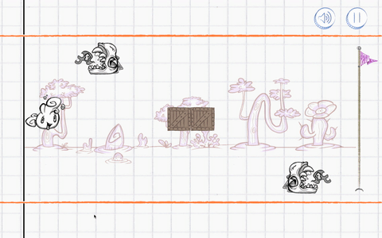

# Do-od

A small little game built around the idea of manipulating the environment instead of the protagonist.

This was built for [LudumDare 35][ludum] with the hearts and souls of team [Omlette du Fromage][team]:
  * [Alexandru Afrasinei][alex] — Programming
  * [Dumitru Nemțuc][dumi] — Programming
  * [Helen Rowlett-Barbu][helen] — Art
  * [Marius Petcu][marius] — Programming
  * [Morco (The Unnamed)][morco] — Team Management
  * [Maria Barte][maria] — Lead Game Design
  * [Ștefan Balea][stefan] — Art

# Builds / Downloads

You can [play in your browser or download a build][builds] for Windows, Linux, OS X or Android on [itch.io][builds].

[alex]: https://github.com/aiafrasinei
[marius]: http://petcu.me
[stefan]: https://www.behance.net/arhifane
[dumi]: https://github.com/dumytru
[morco]: http://www.morco.ro
[maria]: http://students.waterfrontgames.com/m_barte/index.html
[helen]: http://helenrowlett2.wix.com/helenrowlettartist

[builds]: https://omlettedufromage.itch.io/do-od
[team]: http://ludumdare.com/compo/author/omlette-du-fromage/
[ludum]: http://ludumdare.com/compo/ludum-dare-35/
